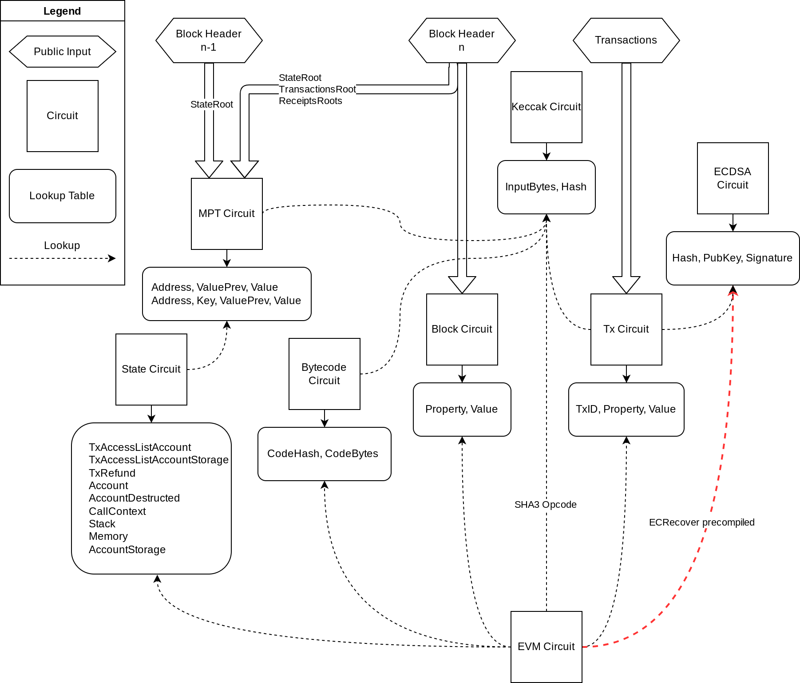

# 架构
<!-- toc -->

# 内容
## 架构图

Each circuit is layouted to be capable to build their own custom constraints. When circuits encounter some expensive operations, they can outsource the effort to other circuits through the usage of lookup arguments. 
The relationship between circuits looks like:
每一个电路都被设计成能够构建它们自己自定义的约束。当电路遇到一些昂贵的操作，他们可以通过使用lookup arguments来将工作外包出去。
电路之间的关系看起来像：

他们生成/验证的电路和表格列表：

| Circuit                                                | Table                                                                                                  |
| ---                                                    | ---                                                                                                    |
| [EVM Circuit](./architecture/evm-circuit.md)           |                                                                                                        |
| [Bytecode Circuit](./architecture/bytecode-circuit.md) | [Bytecode Table](https://github.com/appliedzkp/zkevm-specs/blob/master/specs/tables.md#bytecode_table) |
| [State Circuit](./architecture/state-circuit.md)       | [Rw Table](https://github.com/appliedzkp/zkevm-specs/blob/master/specs/tables.md#rw_table)             |
| Block Circuit                                          | [Block Table](https://github.com/appliedzkp/zkevm-specs/blob/master/specs/tables.md#block_table)       |
| [Tx Circuit](./architecture/tx-circuit.md)             | [Tx Table](https://github.com/appliedzkp/zkevm-specs/blob/master/specs/tables.md#tx_table)             |
| [MPT Circuit](./architecture/mpt-circuit.md)           | MPT Table                                                                                              |
| [Keccak Circuit](./architecture/keccak-circuit.md)     | Keccak Table                                                                                           |
| [ECDSA Circuit](./architecture/ecdsa-circuit.md)       | ECDSA Table                                                                                            |
最终，电路将根据它们的大小和需要的容量被编译。例如，我们可以仅仅使用不同的列来组合两个不同的电路，或者使用相同的列和额外的selector来把它们叠加起来。
为了削减构建一个完整块的证明所需要的时间以及简化证明步骤，如图所示一个聚合电路正在被构建从而压缩每个子电路证明的验证，看[设计笔记，递归](./design/recursion.md)关于在聚合电路上使用的聚合策略的细节。

## 作为lookup table的电路
在Halo2中，lookup是可以灵活配置的。任何能转换成`Expression` 的都可以在lookup中被用作`item: Tuple[int, ...]` 或者 `table: Set[Tuple[int, ...]]`。能够`assert item in table`。`Expression` 包含 `Constant`, `Fixed`, `Advice` 或 `Instance` 的列在任意的rotation上。
将多个电路作为lookup 表的动力是EVM包含很多电路不友好操作，比如随机读写数据访问，“错误”域操作（secp256k1上的ECDSA），传统的哈希函数如`keccak256`，等等..并且它们中很多要接收不了变长的输入。
这些昂贵的操作是的设计EVM电路来验证计算步骤很难，因为每一步骤都可能包含上面涉及到的操作。所以我们尝试分离这些昂贵的操作为拥有更友好设计的单目的的电路，并通过lookups连接它的输入输出，将消耗外包出去的方式使用它。
输入输出lookups能够被用于外包工作的原因是我们知道lookup表是用约束配置来验证输入输出满足某些关系的。例如，我们令字节电路来使一组元组 `(code_hash, index, opcode)`成立，每个`code_hash`被验证为它所包含的opcode 的 keccak256 的散列，并且在EVM电路中，我们可以通过查找字节码表来使用`opcode` 加载`(code_hash, program_counter)`。
但是，有一些性质我们不能保证只使用lookups（最终只能证明所有lookups的内容都是表的子集）。我们想约束所有（查找的）`项`的数量应该等于表的大小，这是由EVM电路和状态电路所需要的以阻止恶意在`表`中写入。 在这个例子（一组查找项准确定义了这张表），我们需要一些额外的约束来确保关系的正确。一个原始的方法是去计数状态电路中所有的项（即最终`表`的大小）并约束它等于EVM电路上计数的值。

## EVM 词语编码

看 [设计笔记, 随机线性组合](./design/random-linear-combinaion.md)

- [词语编码具体要求](https://github.com/appliedzkp/zkevm-specs/blob/master/specs/word-encoding.md)

# 自定义类型

# 常量

| Name                 | Value        | Description                     |
| -------------------- | ------------ | ------------------------------- |
| `MAX_MEMORY_ADDRESS` | `2**40 - 1`  | 允许的最大内存地址 [^1] |
| `MAX_GAS`            | `2**64 - 1`  | 最大Gas allowed                 |
| `MAX_ETHER`          | `2**256 - 1` | 允许的最大以太值 [^2] |

[^1]：在EVM上隐藏的最大内存地址实际上是`32 * (2**32 - 1)`，它是那个不会使内存扩展的Gas消耗溢出`u64`的。在我们的例子中，内存地址被允许为5个字节，但是在成功的例子中将约束内存扩展的Gas消耗适配 `u64`。

[^2]: 我没有发现一个隐含的上限在以太坊的值上（对`balance` 或者 `gas_price`）在黄皮书中，但是处理无上限大整数看起来在电路里是不现实的，所以使用`u256` 作为一个硬上限就显得合理了。