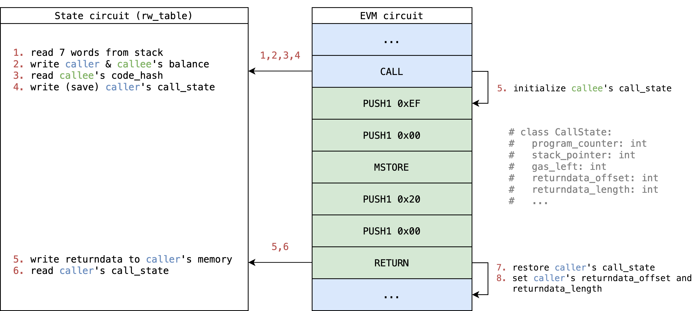

# EVM 电路

<!-- toc -->

# 介绍

EVM电路对交易进行迭代包括在验证交易中每一个执行步骤有效的证明。基本上一个步骤的规模与EVM上相同，所以通常我们一个步骤处理一个opcode，除了像`SHA3` 或者 `CALLDATACOPY` 这样在变长内存上操作的opcode，它们需要多个“虚拟”步骤。

> 一个步骤的规模在某种程度上可能是不同的，这依赖于实现方法，一个极端的例子是实现一个降低指令集（如TinyRAM）的 VM 来模拟EVM，这里面会有更小得多的步骤，但是不确定如何与当前的步骤做比较。
> 
> **han**

未来验证有效的步骤，我们首先要列举一个步骤在EVM中所有可能的执行结果，包括成功和错误的例子，然后构建一个自定义约束来验证在每一个执行结果中步骤转换是对的。

对于每一步骤来说，我们约束它使得它只能是执行结果之一，然后尤其是，去约束第一步骤是`BEGIN_TX`，然后重复这个步骤来验证完整的执行轨迹。同时每个步骤都可以访问下一个步骤来跟踪轨迹信息，通过下面的约束：
`assert next.program_counter == curr.program_counter + 1`.

# 概念

## 执行结果

直觉上每个opcode都作为步骤的一个分支。但是，EVM拥有如此富足的opcode其中一部分的与 `{ADD,SUB}`, `{PUSH*}`, `{DUP*}` 和 `{SWAP*}` 非常相似这些似乎是由几乎相同的约束来处理的，只需要做一些小小的挑战（交换一个值或者由线性关系自动完成），似乎我们能够减少我们的工作通过只实现一次就能在单个分支里处理多个opcode。

另外，一个EVM状态转换也能过包含几种错误例子，我们也需要考虑到这些因素已能够跟EVM保持一致。每一个opcode分支去处理它们自己的错误例子是很烦的因为这需要去停止步骤然后返回执行内容给caller。

幸运的是，大部分错误例子使用预构建的lookup表是很容易被验证的，即使这些错误发生在很多的opcode上，只有一些棘手的错误例如out of gas 因为需要动态的Gas用量需要被逐一验证。所以我们进一步展开所有种类的错误例子作为执行结果的种类。

所以我们可以列举[所有可能的执行结果](https://github.com/appliedzkp/zkevm-specs/blob/83ad4ed571e3ada7c18a411075574110dfc5ae5a/src/zkevm_specs/evm/execution_result/execution_result.py#L4)  并将EVM电路转换成终极状态机如：

- **BeginTx**:
    - 一笔交易的开始。
- **EVMExecStates** = [ SuccessStep | ReturnStep ]
- **SuccessStep** = [ ExecStep | ExecMetaStep | ExecSubStep ]
    - 在调用中成功并继续执行的状态集合
- **ReturnStep** = [ ExplicitReturn | Error ]
    - 停止调用的执行并返回给caller或者执行下一步骤的状态集合
- **ExecStep**:
    - 带有 opcode 的 GethExecStep 的 1-1 映射来将一个单一步骤映射到一个单一的小工具上。例如：`ADD`, `MUL`, `DIV`, `CREATE2`。
- **ExecMetaStep**:
    - 带有 opcode 的 GethExecStep 的 N-1 映射来将（相似的）单一步骤共享同一个小工具。例如 `{ADD, SUB}`, `{PUSH*}`, `{DUP*}` 和 `{SWAP*}`.
- **ExecSubStep**:
    - 带有 opcode 的 GethExecStep 的 1-N 映射来处理由多个步骤产生的动态大小的数组
        - `CALLDATACOPY` -> CopyToMemory
        - `RETURNDATACOPY` -> TODO
        - `CODECOPY` -> TODO
        - `EXTCODECOPY` -> IN PROGRESS
        - `SHA3` -> IN PROGRESS
        - `LOGN` -> CopyToLog
- **ExplicitReturn**:
    带有 opcode 的 GethExecStep 的 1-1 映射来从一个没有异常的调用中返回
- **Error** = [ ErrorEnoughGas | ErrorOutOfGas ]
    - 由opcodes导致的异常相关联的状态集合
- **ErrorEnoughGas**:
    - 与out of gas 不相关的错误状态集合。
    例如：
      `InvalidOpcode`, `StackOverflow`, `InvalidJump`.
- **ErrorOutOfGas**:
    - opcodes运行致out of gas的错误状态集合。对于每一个拥有动态内存Gas用量的opcode（有时候是opcode的集合），由一个特定的**ErrorOutOfGas** 错误状态。
- **EndTx**
    - 终止交易。
- **EndBlock**
    - 结束一个区块（也可以为其与状态步骤槽的填充）

> 在当前的实现中，我们让opcode实现者也实现了错误的例子，这似乎是冗余的工作。
> 但是通过做这些，它们可以更专注于opcode的成功例子。错误例子也通常更容易验证，所以我认为这也降低了整体的实现复杂性。
>
> **han**

## 随机访问数据

在EVM中，解释器由能力去做任何对数据的随机访问，如区块内容，账户余额，当前区域的栈和内存，等等。这些访问的内容有些是可读可写的，有些是只读的。
在EVM电路中，我们利用[电路作为查找表](#Circuit-as-a-lookup-table)的概念去复制这些随机数据访问到其他不同layout的电路上并验证这些是一致的并且有效的。在这些随机数据访问被验证后，我们可以当作它们仅仅只是一张表一样去使用它们。[这里](https://github.com/appliedzkp/zkevm-specs/blob/83ad4ed571/src/zkevm_specs/evm/table.py#L108) 就是当前在EVM电路里使用的表格。

对于可读可写的访问数据，EVM电路使用一个持续的`rw_counter` （读写计数器）去查找状态电路来保证读写是按照时间先后排列顺序的。它还使用一个标志 `is_write` 去检查不同写访问下的数据一致性。

对于只读访问数据，EVM电路直接去查找字节电路，交易电路和调用电路。

## Reversible write reversion
## 可回退的写回退

在EVM中，可回退的写可能被回退如果调用失败的话。有很多种可逆的写，完整的列表可以在[这里](https://github.com/ethereum/go-ethereum/blob/master/core/state/journal.go#L87-L141) 找到。
在EVM电路中，每一个调用被贴上一个标签（`is_persistent`）来获知它是否成功。所以理想情况下，我们只需要去回退这些在回退之前会影响未来执行种类的可回退写操作：

- `TxAccessListAccount`
- `TxAccessListStorageSlot`
- `AccountNonce`
- `AccountBalance`
- `AccountCodeHash`
- `AccountStorage`

在一些其他的地方我们不需要去做回退因为它们在回退之前不影响未来的执行，当`is_persistent` 是1时，我们仅仅写它们：

- `TxRefund`
- `AccountDestructed`

> 另一个标签是 `TxLog`，它也不会影响到未来的执行。在我们决定哪里去构建收据库之后，它应该被解释哪里写这些记录。
>
> **han**

To enable reversible write reversion, we need some meta information of a call:

1. `is_persistent` - To know if we need reversion or not.
2. `rw_counter_end_of_reversion` - To know at which point in the future we should revert.
3. `reversible_write_counter` - To know how many reversible writes we have done until now.

Then at each reversible write, we first check if `is_persistent` is `0`, if so we do an extra reversible write at `rw_counter_end_of_reversion - reversible_write_counter` with the old value, which reverts the reversible write in a reverse order.

For more notes on reversible write reversion see:
- [Design Notes, Reversible Write Reversion Note 1](../design/reversible-write-reversion.md)
- [Design Notes, Reversible Write Reversion Note 2](../design/reversible-write-reversion2.md)

为了能够回退可回退的写操作，我们需要一些关于调用的元信息：

1. `is_persistent` - 获知是否我们需要回退。
2. `rw_counter_end_of_reversion` - 获知我们未来在哪个点上回退。
3. `reversible_write_counter` - 获知直到现在我们已经做了多少可回退写操作。 

## Opcode 获取

在 EVM电路中，有三类opcode源用于执行或者拷贝：
1.  合约交互
    Opcode 是通过元组 `(code_hash, index, opcode)` 从字节码电路中的合约字节码中查找到的。
2.  在根调用上的合约创建
    Opcode 是通过元组 `(tx_id, TxTableTag.Calldata, index, opcode)` 从交易电路中的tx calldata中查找到的。
3.  在内部调用上的合约创建
    Opcode 是通过元组 `(rw_counter, False, caller_id, index, opcode)` 从状态电路中的调用者内存中查找到的。

在从任意源获取opcode之前，它检查是否索引在一个给定范围内，如果不在，它遵循当前 EVM 的行为去隐式得返回`0`。

## 内部调用

EVM 支持由opcode触发的内部调用。在 EVM 电路里，触发内部调用的这些 opcode（如 `CALL` 或 `CREATE`）将：
- 保存它们自己的`call_state` 到状态电路中
- 启动下一个调用的内容
- 初始化下一步骤的 `call_state` 来启动一个新环境。

然后这些opcodes（如 `RETURN` 或 `REVERT`）和错误例子被终止，将存储调用者的`call_state` 并将其设置为下一个步骤。

对一个简单的`CALL`例子的说明（为使简洁很多细节被隐藏了）：

## 内部调用

# 约束

## `main`

==TODO== Explain each execution result

# 实现

- [spec](https://github.com/appliedzkp/zkevm-specs/blob/master/specs/evm-proof.md)
    - [python](https://github.com/appliedzkp/zkevm-specs/tree/master/src/zkevm_specs/evm)
- [circuit](https://github.com/appliedzkp/zkevm-circuits/tree/main/zkevm-circuits/src/evm_circuit)
