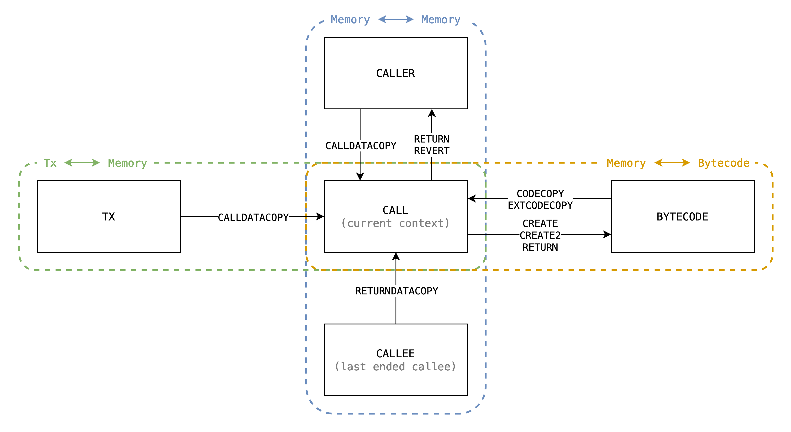

# 多步骤实现

<!-- toc -->

# 介绍

In EVM, there are serveral opcodes moving dynamic-length bytes around between different sources, here is a complete list:
在 EVM，有几个opcode在不同的源之间移动动态长度的字节。这里是完整的列表：

    
<table>
<thead>
<tr>
<th>Type</th>
<th>Opcode</th>
<th>Source</th>
<th>Destination</th>
</tr>
</thead>
<tbody>
<tr>
<td rowspan="3">1</td>
<td><code>CODECOPY</code> <code>EXTCODECOPY</code></td>
<td><code>bytecode[code_hash]</code></td>
<td><code>calls[call_id].memory</code></td>
</tr>
<tr>
<td><code>CALLDATACOPY and is_root</code></td>
<td><code>txs[tx_id].calldata</code></td>
<td><code>calls[call_id].memory</code></td>
</tr>
<tr>
<td><code>CALLDATACOPY and not_root</code></td>
<td><code>calls[caller_call_id].memory</code></td>
<td><code>calls[call_id].memory</code></td>
</tr>
<tr>
<td>2</td>
<td><code>RETURNDATACOPY</code></td>
<td><code>calls[callee_call_id].memory</code></td>
<td><code>calls[call_id].memory</code></td>
</tr>
<tr>
<td rowspan="2">3</td>
<td><code>RETURN and is_create</code> <code>CREATE</code> <code>CREATE2</code></td>
<td><code>calls[call_id].memory</code></td>
<td><code>bytecode[code_hash]</code></td>
</tr>
<tr>
<td><code>SHA3</code></td>
<td><code>calls[call_id].memory</code></td>
<td>TBD</td>
</tr>
<tr>
<td rowspan="2">4</td>
<td><code>RETURN and not_create</code></td>
<td><code>calls[call_id].memory</code></td>
<td><code>calls[caller_call_id].memory</code></td>
</tr>
<tr>
<td><code>REVERT and not_create</code></td>
<td><code>calls[call_id].memory</code></td>
<td><code>calls[caller_call_id].memory</code></td>
</tr>
</tbody>
</table>

说明：

这些可以被分类为4中类型：

1. `* -> 内存 (padding)`
    - 介绍:
        - `CALLDATACOPY`
        - `CODECOPY`
        - `EXTCODECOPY`
    - 从calldata或者代码中拷贝到当前内存。
    - 当复制到源的范围之外时内存被用0填满，换句话说，源被用0填充到范围内。
2. `* -> 内存 (no padding)`
    - 包含 `RETURNDATACOPY`.
    - 类似于类型1，但是范围被隐晦得在源范围内被检查，否则EVM被异常终止。所以没有padding的事儿。
3. `内存 -> * (no range capped)`
    - 包含:
        - `RETURN` 当 `is_create`
        - `CREATE`
        - `CREATE2`
        - `SHA3`
    - 从当前内存到目的地的拷贝
    -没有padding的事儿是因为内存总是因为lazy初始化而隐式得扩展
4. `内存 -> * (range capped)`
    - 包含:
        - `RETURN` 当 `not_create`
        - `REVERT` 当 `not_create`
    - 类似于类型3，但是范围被调用者的assignment所限制。

## 方法

### 方法 #1 - 获得前一步骤的访问

以`CALLDATALOAD` 为例，在 @icemelon 的 [方法](https://github.com/appliedzkp/zkevm-specs/blob/2864c3f0f6cb905b8548da9cde76fea13a42085f/src/zkevm_specs/evm/execution_result/calldatacopy.py)，它需要获得前一个步骤来推断当前步骤的状态是什么，来知道是否这是第一步，我们检查

1. `curr.opcode == CALLDATALOAD`
2. `prev.execution_state != CALLDATALOAD or prev.finished is True`

并且在最后一步转换`StepState`，它从是否剩余去复制的字节小于步骤数量去推断出来。

### 方法 #2 - 介绍内部 `ExecutionState`

这个方法用`ExecutionState`转换的额外约束介绍内部`ExecutionState`，并且通过前一步骤输入将被传递，新的 `ExecutionState`是：

- `CopyMemoryToMemory`
    - 仅可以转换自：
        - `RETURN`
        - `REVERT`
        - `CALLDATACOPY`
        - `RETURNDATACOPY`
    - 输入：
        - `src_call_id` - 源调用的索引（被读）
        - `dst_call_id` - 目的地调用的索引（被写）
        - `src_end` - 源终点，当索引超过它时返回`0`。 
        - `src_offset` - 源调用的内存偏移
        - `dst_offset` - 目的地调用的内存偏移
        - `bytes_left` - 有多少剩余字节被拷贝
    - 笔记:
        - `src_end`仅由`CALLDATACOPY` 使用因为只有它需要padding。
- `CopyTxCalldataToMemory`
    - 仅能转换自`CALLDATACOPY`
    - 输入:
        - `tx_id` - 当前交易的索引
        - `src_end` - end of source, it returns `0` when indexing out of this
        - `src_offset` - calldata offset of tx
        - `dst_offset` - memory offset of current call
        - `bytes_left` - how many bytes left to copy

- `CopyBytecodeToMemory`
    - Can only transited from:
        - `CODECOPY`
        - `EXTCODECOPY`
    - Inputs:
        - `code_hash` - hash of bytecode
        - `src_end` - end of source, it returns `0` when indexing out of this
        - `src_offset` - calldata offset of tx
        - `dst_offset` - memory offset of current call
        - `bytes_left` - how many bytes left to copy

- `CopyMemoryToBytecode`
    - Can only transited from:
        - `CREATE` - copy init code
        - `CREATE2` - copy init code
        - `RETURN` - copy deployment code
    - Inputs:
        - `code_hash` - hash of bytecode
        - `src_offset` - calldata offset of tx
        - `dst_offset` - memory offset of current call
        - `bytes_left` - how many bytes left to copy
    - Note
        - `CopyBytecodeToMemory`的区别是它没有padding。

> 如果我们能够拥有一个更好的方法去进一步概括这些内部`ExecutionState`，我们可以有更少得冗余实现。
>
> **han**

并且它们通过触发`ExecutionState`用范围检查做字节拷贝。

而且这些内部`ExecutionState`总是传播`StepState`作为相同值。因为转换已经由`ExecutionState`触发完成了。

先以`CALL`再以`CALLDATALOAD`为例：

- 调用者使用栈的值执行`CALL`（名字引用自[`instruction.go#L668`](https://github.com/ethereum/go-ethereum/blob/master/core/vm/instructions.go#L668)）
    - `inOffset = 32`
    - `inSize = 32`
- 调用者使用栈的值执行`CALL`（名字引用自[`instruction.go#L301-L303`](https://github.com/ethereum/go-ethereum/blob/master/core/vm/instructions.go#L301-L303)):
	- `memOffset = 0`
	- `dataOffset = 64`
	- `length = 32`
- `CopyMemoryToMemory`的第一步骤将获得输入:
    - `src_call_id = caller_call_id`
    - `dst_call_id = callee_call_id`
    - `src_end = inOffset + inSize = 64`
    - `src_offset = inOffset + dataOffset = 96`
    - `dst_offset = memOffset = 0`
    - `bytes_left = length = 32`
然后，在每一步骤中我们检查是否`src_offset < src_end`，如果不是，我们需要去关掉源查找并且将零填写到目的地。然后用我们在步骤中处理的字节的数量加上`*_offset`，并减去`bytes_left`，再传递到下一步骤。

## 总结

两个方法的对比

- 方法 #1
    - 优点
        - 没有额外的 `ExecutionState`
    - 缺点
        - 每个多步骤子节点都有至少3个额外嵌套分支：
            - `is_first` - 如果是第一步
            - `not_first` - 如果是第n步
            - `is_final` - 如果是最终步
- 方法 #2
    - 优点
        - 每一个多步骤字节码仅需要准备这些内部`ExecutionState`的输入并做正确的`StepState` 转换。
        - 只有两个嵌套分支:
            - `not_final` - 如果是第n步
            - `is_final` - 如果是最终步
    - 缺点
        - 额外的 `ExecutionState`

在当前实现的内容中，方法#2看起来更容易实现因为复杂性的分离，并也需要更少的证明消耗。
重新设计EVM电路（重新使用指令而不是构建更大的自定义门）的内容中，显得两个方法的证明消耗没有不同，但是方法#2显得更好因为它提取嵌套分支并且应该减少行的使用。