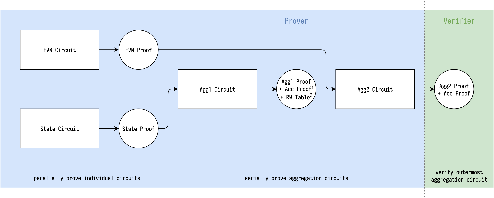

# 递归

<!-- toc -->

## 项目

- <https://github.com/AztecProtocol/barretenberg>
- <https://github.com/scroll-tech/halo2-snark-aggregator>
- <https://github.com/trapdoor-Tech/halo2-aggregation>
- <https://github.com/matter-labs/solidity_plonk_verifier/tree/recursive>

### Aztec barretenberg

#### 内积的Transcript 

rollup电路使用blake2s生成挑战数，但是使用的pedersen哈希[^barretenberg-transcript]来压缩的输入。这个输入被序列化成一组31字节的域元素作为pedersen哈希的输入。
rollup电路也使用128比特挑战数去降低MSM的工作，然后大部分标量也是128比特，仅这些与其它值相乘的标量（例如  \\(\zeta\omega^i\\) 或者批量计算）需要254比特的MSM。
[^barretenberg-transcript]: <https://github.com/AztecProtocol/barretenberg/blob/master/barretenberg/src/aztec/plonk/transcript/transcript.cpp#L128-L130>

#### 内积电路的公共输入

Barretenberg按照转换论证[^barretenberg-permutation-widget]去处理公开输入。它的约束系统隐含得复制了公共输入p到第一列的前m个witness上，并且因为这些公共输入贡献 \\(\frac{1}{\delta}\\) 到大乘法（？？）上是很容易去计算的，所以这不需要在\\(\zeta\\)处去计算公共输入多项式。而是验证大乘法的最后一个值是贡献值 \\(\delta\\)。

$$
\frac{1}{\delta} = \prod_{i\in[m]}\left(\frac{p_i + \beta\omega^i + \gamma}{p_i + \beta k_{p}\omega^i + \gamma}\right)
$$

> 不确定这是否比计算公开输入值更便宜，但是确实很有意思。
>
> **han**

真实验证者在内积电路中不计算 \\(\frac{1}{\delta}\\)，而是将所有的输入串联起来并且用rollup电路为每一个内积电路去计算 \\(\frac{1}{\delta}\\)。

[^barretenberg-permutation-widget]: 解释: <https://github.com/AztecProtocol/barretenberg/blob/master/barretenberg/src/aztec/plonk/proof_system/public_inputs/public_inputs_impl.hpp#L5-L137>  在置换widget中使用: <https://github.com/AztecProtocol/barretenberg/blob/master/barretenberg/src/aztec/plonk/proof_system/widgets/random_widgets/permutation_widget_impl.hpp#L368-L369>

## 计算

### 差值

#### Barycentric 公式 [^barycentric-formula]

使用

$$
\begin{aligned}
& \ell(x) = (x-x_0)(x-x_1)\cdots(x-x_k) \\
& \ell^\prime(x_j) = \frac{d\ell(x)}{dx}\rvert_{x=x_j} = \prod_{i=0,i\ne j}^k(x_j-x_i)
\end{aligned}
$$

我们可以重写拉格朗日basis为

$$
\ell_j(x) = \frac{\ell(x)}{\ell^\prime(x_j)(x-x_j)}
$$

或者通过定义 _barycentric weights_

$$
w_j = \frac{1}{\ell^\prime(x_j)}
$$

再给定多项式 \\(f\\) 的值$\{y_i\}_{i\in[k]} = \{f(x_i)\}_{i\in[k]}$，\\(f\\)的差值可以按照如下计算：

$$
f(x) = \ell(x) \sum_{j=0}^k\frac{w_j}{x-x_j}y_j
$$

如果权重\\(w_j\\)可以被提前计算，那么需要的就仅仅只是 \\(\mathcal{O}(k)\\) 相对应于 \\(\mathcal{O}(k^2)\\)来单独计算拉格朗日basis \\(\ell_j(x)\\) 

我们可以通过考虑对常数函数\\(g(x) = 1\\)做barycentric插值来进一步简化它

$$
g(x) = 1 = \ell(x) \sum_{j=0}^k\frac{w_j}{x-x_j}
$$

用\\(g(x) = 1\\)去除\\(f(x)\\) 并不会修改插值，却产生了

$$
f(x) = \frac{\sum_{j=0}^k\frac{w_j}{x-x_j}y_j}{\sum_{j=0}^k\frac{w_j}{x-x_j}}
$$

然后我们甚至不需要去计算\\(\ell(x)\\)。

[^barycentric-formula]: <https://people.maths.ox.ac.uk/trefethen/barycentric.pdf>  <https://en.wikipedia.org/wiki/Lagrange_polynomial#Barycentric_form>

#### rotation集合的插值

Defining rotation set \\(R\\) contains \\(k\\) different points \\(\{\zeta_1\omega_j\}_{j\in[k]}\\), where \\(\zeta_1\\) is the challenge opening point, and \\(\omega_i\\) are the generator to some power (a.k.a rotation).

> Not sure if all arguments of halo2 in the future still have the same opening base \\(\zeta_1\\) for all queries to multiopen. If not, this approach might not work. An implementation can be found [here](https://github.com/han0110/halo2/blob/feature%2Fbarycentric-for-r/halo2_proofs/src/poly/multiopen/shplonk/verifier.rs#L60-L99).
>
> **han**

In SHPLONK, the verifier needs to calculate interpolation \\(r(\zeta_{2})\\) from rotation set \\(R\\) and their claimed evaluation value \\(\{y_j\}_{j\in[k]}\\).

One of the largest benefit of barycentric formula is pre-computed barycentric weight. Although \\(R\\) contains different values in each proof, we can still pre-compute the normalized barycentric weight without \\(\zeta_1\\), to gain the benefit.

$$
w_j = \frac{1}{\prod_{i=0,i\ne j}^k(\omega_j-\omega_i)}
$$

And for each rotation set, the actual work is 

$$
w_j^\prime = \frac{w_j}{\zeta_1^{k-1} * (\zeta_2 - \zeta_1\omega_j)}
$$

Also each rotation set might contain more than one polynomials, for each polynomial, its work is

$$
r(\zeta_2) = \frac{\sum_{j=0}^kw_j^\prime y_j}{\sum_{j=0}^kw_j^\prime}
$$

Where the denominator for one set only needs to be calcuated once.

定义rotation集合\\(R\\)包含\\(k\\)个不同的点\\(\{\zeta_1\omega_j\}_{j\in[k]}\\), 其中 \\(\zeta_1\\)是挑战打开点，并且\\(\omega_i\\) 是一些幂的生成元（又称rotation）。

#### 公共输入的插值

All lagrange basis could be rotated from the $\ell_0(X) = \frac{X^n-1}{n(X-1)}$
所有拉格朗日basis能够从 $\ell_0(X) = \frac{X^n-1}{n(X-1)}$ 中被旋转出来

$$
\ell_i(X) = \ell_0(X\omega^{-i}) = \frac{X^n-1}{n(X\omega^{-i}-1)}
$$

给出 \\(m\\)公开输入 \\(p\\)，在\\(\zeta\\)处的插值是

$$
p(\zeta) = \sum_{i\in[m]}p_i\ell_i(\zeta) = \frac{\zeta^n-1}{n}\sum_{i\in[m]}\frac{p_i}{(\zeta\omega^{-i}) - 1}
$$

注意 \\(\frac{\zeta^n-1}{n}\\) 需要 \\(\log_2(n)\\) 对 \\(\zeta\\)的平方进行减法和除法。
并且每一个额外的公开输入消耗差不多4个操作（乘+减+除+加）

## 随机想法

### ZKEVM使用多层递归证明

In our case, we have split ZKEVM into different pieces, with some dependency relation in between.

Fortunately, the dependency relation currently is always being like: One verified circuit serves itself as a lookup table for another. For example, once State circuit is verified to satasify its own relation, then we can synthesize its columns to be a lookup table for EVM circuit to do random access.

Serving self as a lookup table only needs to pass a single check, that is the table commitment(s) (random linearly combined or not). And the difference between fixed table and such verified private table is: The former is built when setup so it is already trusted, the latter is verified for each proof instance and is trusted as long as the relation is well-defined.

So, if a single recursive circuit can't aggregate all different circuits in ZKEVM, we can incrementally aggregate them, and only expose the verified private table's commitment(s) as public input, for next proofs' aggregation.

> If we can have some kinds of "global randomness", we can do vector table's random linear combination first, then the extra public input for exposing verified private table is just a single group element (4 values in rns).
>
> **han**

Illustration of serially aggregating State circuit and EVM circuit:

1. Accumulated proof which contains LHS and RHS of pairing  
2. RW Table contains 10 commitments which are verified to open to desired synthesized expressions

在我们的案例中，我们把zkEVM分成不同部分，其中它们之间有依赖关系。

幸运的是，当前的依赖关系总是像这样：一个验证电路被另一个电路当作一个lookup表。例如，一旦状态电路被验证满足其自身的需求，那么我们可以合成它的列为EVM电路的一个lookup表来做随机访问。
作为一个lookup表仅需要通过一个单个的检查，这是表的承诺（是随机线性组合或者不是）。并且fixed tabke 和这种被验证的私有表之间的不同之处是：前者在setup的时候就被创建了，所以它已经是可信的了，后者被每个证明instance验证并且只要关系被定义好就是可信的。

所以，如果在zkEVM中单个递归电路不能聚合所有不同的电路，我们可以增量得聚合他们，并且为下一个证明聚合仅暴露被验证的私有表的承诺作为公开输入。

> 如果我们有多种“全局随机数”，我们可以首先做向量表的随机线性组合，然后曝光的被验证的私有表的额外的公开输入仅仅是一个单个群元素（rns上的4个值）。
>
> **han**

串行聚合状态电路和EVM电路的说明：

1. 包含LHS和RHS配对的聚合证明  
2. RW 表包含10个承诺其中被验证去打开所需要的合成表达式
