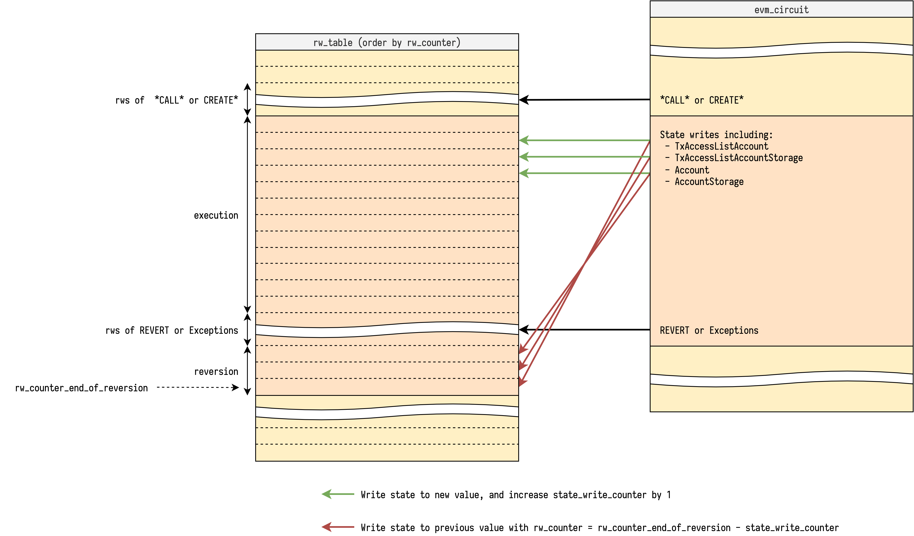
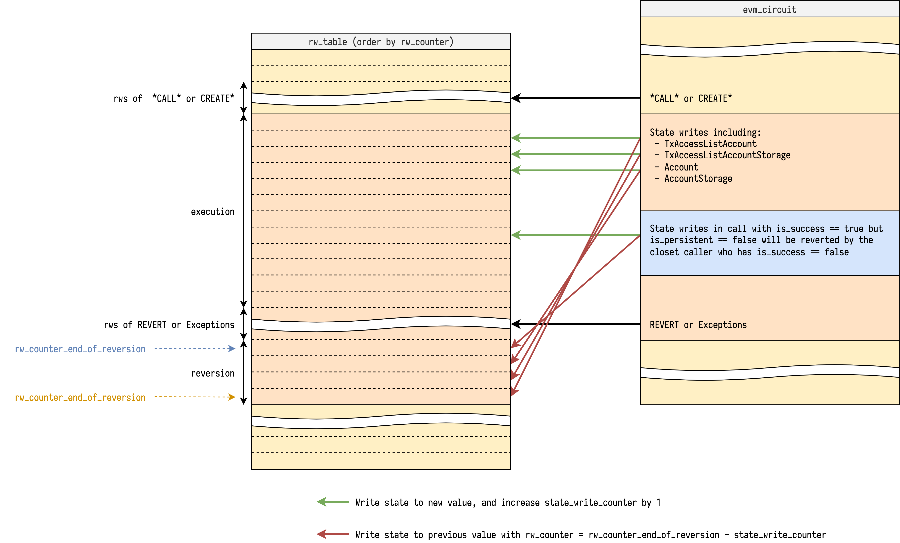

# 可回退的写回退

可回退的写回退可能是解释EVM电路时最tricky的部分。这个文档只在说明当前方法是如何用一些图实现的，并且收集所有其它的方法做比较。

## 回退与否

With full execution trace of a block, if we iterate over it once, we can know if each call (including create) is successful or not, and then determine which reversible writes are persistent, and which are not.

So each call could be annotated with 2 tags:

- `is_success` - If this call ends with `STOP` or `RETURN`
- `is_persistent` - If this call and all its caller have `is_success == true`

Only reversible writes inside a call with `is_persistent == true` will be applied to the new state.  Reversible writes in a call with `is_persistent == false` will be reverted at the closest call that has `is_success == false`.

对于一个区块完整执行路径，如果我们迭代一次，我们可以知道是否每一个调用（包括create）是否成功，并且再确定哪一个可回退写是一致的，哪一个不是。

所以每一个调用能够被用2个标签引用：
- `is_success` - 如果这个调用终结于`STOP` 或者 `RETURN`
- `is_persistent` - 如果这个调用和所有的调用者都有 `is_success == true`


## 当前方法

Since the only requirement of a read/write access is `rw_counter` uniqueness, we are not restricted to only do read/writes with sequential `rw_counter` in a step, instead we can do read/write with any `rw_counter`, as long as we don't break the `rw_counter` uniqueness requirement.

We ask the prover to tell us each call's information including:

- `is_success` - Described above
- `is_persistent` - Described above
- `rw_counter_end_of_reversion` - The `rw_counter` at the end of reversion of the call if it has `is_persistent == false`

In EVM circuit we track the value `reversible_write_counter` to count how many reversible writes have been made so far.  This value is initialized at `0` of each call.

With `is_persistent`, `rw_counter_end_of_reversion` and `reversible_write_counter`, we can do the reversible write with its corresponding reversion at the same step, because we know at which point it should happen. The pseudo code of reversible write looks like:
因为只有读写访问的需求是`rw_counter`的唯一性，我们并没有被限制在在一个步骤中使用连续的`rw_counter` 只做读/写，而是我们可以使用任意的`rw_counter`做读/写，只要我们没有破坏`rw_counter`的唯一需求。

我们问证明者告诉我们每一个调用信息包括：

- `is_success` - 上面描述的
- `is_persistent` - 上面描述的
- `rw_counter_end_of_reversion` - 如果有`is_persistent == false` 就在调用的回退的最后是 `rw_counter`

```python
rw_table.lookup(
    rw_counter=rw_counter,
    reversible_write=reversible_write, # write to new value
)

if not is_persistent:
    rw_table.lookup(
        rw_counter=rw_counter_end_of_reversion - reversible_write_counter,
        reversible_write=reversible_write.reverted(), # write to previous value
    )

rw_counter += 1
reversible_write_counter += 1
```

注意我们正在增加 `reversible_write_counter`，所以回退被用在`rw_table`的回退顺序上，这是我们想要的正确顺序。

另一个重要的检查是去确认`rw_counter_end_of_reversion`是正确的。在这个步骤中做回退，我们检查是否有`rw_counter`的gap到下一个步骤（？？？），其中gap的大小正好是`reversible_write_counter`。并且gap的最后面，`rw_counter` 正好是 `rw_counter_end_of_reversion`。伪代码看起来就是：

```python
if not is_persistent:
    assert rw_counter_end_of_reversion == rw_counter + reversible_write_counter
    rw_counter = call.rw_counter_end_of_reversion + 1
```

如图:



做回退的步骤也是对成功调用的回退负责。注意每一个调用的`reversible_write_counter`被初始化为0。为了确认他们在正确的`rw_counter`能够做回退，我们需要传播`rw_counter_end_of_reversion` 使其变成它减去当前累加的 `reversible_write_counter`。伪代码如下：

```python
if not is_persistent and callee_is_success:
    assert callee_rw_counter_end_of_reversion \
        == rw_counter_end_of_reversion - reversible_write_counter
```



成功调用的最后面，我们累加`reversible_write_counter`到它的调用者。

### 为 `SELFDESTRUCT`做调整

看 [Design Notes, Reversible Write Reversion Note2, SELFDESTRUCT](./reversible-write-reversion2.md#selfdestruct)

## 其它方法

### 使用 `revision_id`

TODO
