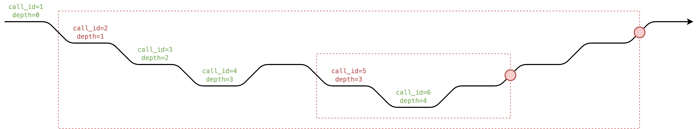

# 可回退写回退笔记2

# ZKEVM - 状态电路扩展 - `StateDB`

## 回退

在EVM中，当任意内部调用失败时有多种`StateDB`更新能够被回退。

- `tx_access_list_account` - `(tx_id, address) -> accessed`
- `tx_access_list_storage_slot` - `(tx_id, address, storage_slot) -> accessed`
- `account_nonce` - `address -> nonce`
- `account_balance` - `address -> balance`
- `account_code_hash` - `address -> code_hash`
- `account_storage` - `(address, storage_slot) -> storage`

完整列表可以在[这里](https://github.com/ethereum/go-ethereum/blob/master/core/state/journal.go#L87-L141)被发现。对于`tx_refund`, `tx_log`, `account_destructed`我们不需要去写或者回退因为这些状态改变不影响位未来的执行，所以我们仅当`is_persistent=1`.才写这些值。

### 可视化

- Black arrow represents the time, which is composed by points of sequential `rw_counter`.
- Red circle represents the revert section.

The actions that write to the `StateDB` inside the red box will also revert themselves in the revert section (red circle), but in reverse order.

Each call needs to know its `rw_counter_end_of_revert_section` to revert with the correct `rw_counter`. If callee is a success call but in some red box (`is_persistent=0`), we need to copy caller's `rw_counter_end_of_revert_section` and `reversible_write_counter` to callee's.

## `SELFDESTRUCT`

The opcode `SELFDESTRUCT` sets the flag `is_destructed` of the account, but before that transaction ends, the account can still be executed, receive ether, and access storage as usual. The flag `is_destructed` takes effect only after a transaction ends.

In particular, the state trie gets finalized after each transaction, and only when state trie gets finalized the account is actually deleted. After the transaction with `SELFDESTRUCT` is finalized, any further transaction treats the account as an empty account.

> So if some contract executed `SELFDESTRUCT` but then receive some ether, those ether will vanish into thin air after the transaction is finalized. Soooo weird.
>
> **han**

The `SELFDESTRUCT` is a powerful opcode that makes many state changes at the same time including:

- `account_nonce`
- `account_balance`
- `account_code_hash`
- all slots of `account_storage`

The first 3 values are relatively easy to handle in circuit: we could track an extra `selfdestruct_counter` and `rw_counter_end_of_tx` and set them to empty value at `rw_counter_end_of_tx - selfdestruct_counter`, which is just how we handle reverts.

However, the `account_storage` is tricky because we don't track the storage trie and update it after each transaction, instead we only track each used slot in storage trie and update the storage trie after the whole block.

- 黑色箭头代表组合序列`rw_counter`的点的时间。
- 红色圆圈代表回退区域

这个行为写到包含红色盒子的`StateDB`中，也将在回退区域（红色圆圈）中回退他们自己，但是是按照回退顺序的。
每一次调用需要知道它的`rw_counter_end_of_revert_section`来用正确的`rw_counter` 做回退。如果调用是成功调用成功但是在红色盒子里(`is_persistent=0`)，我们需要拷贝调用者的`rw_counter_end_of_revert_section` 和 `reversible_write_counter`给被调用函数。

### 一致性检查的工作区

看起来我们需要使用一个 `revision_id` 去引用每一个账户。 `revision_id`仅当 `is_destructed`被设置并且`tx_id`变了才增加。不同的`revision_id`我们能够为`nonce`, `balance`, `code_hash`, 和每一个 `storage` 重置状态电路的值就像我们初始的内存。

所以`address -> is_destructed`变成了 `(tx_id, address) -> (revision_id, is_destructed)`。

然后我们加一个额外的`revision_id`到 `nonce`, `balance`, `code_hash` 和 `storage`。对于 `nonce`, `balance` 和 `code_hash` 我们用`(address, revision_id) -> {nonce,balance,code_hash}`组合他们，对于`storage`我们用`(address, storage_slot, revision_id) -> storage_value`把它组合起来。
这里是一个用`revision_id`的 `account_balance`的例子

$$
\begin{array}{|c|c|}
\hline
\texttt{address} & \texttt{revision_id} & \texttt{rwc} & \texttt{balance} & \texttt{balance_prev} & \texttt{is_write} & \text{note} \\\\\hline
\color{#aaa}{\texttt{0xfd}} & \color{#aaa}{\texttt{-}} & \color{#aaa}{\texttt{-}} & \color{#aaa}{\texttt{-}} & \color{#aaa}{\texttt{-}} & \color{#aaa}{\texttt{-}} \\\\\hline
\texttt{0xfe} & \texttt{1} & \color{#aaa}{\texttt{x}} & \texttt{10} & \color{#aaa}{\texttt{x}} & \texttt{1} & \text{open from trie} \\\\\hline
\texttt{0xfe} & \texttt{1} & \texttt{23} & \texttt{20} & \texttt{10} & \texttt{1} \\\\\hline
\texttt{0xfe} & \texttt{1} & \texttt{45} & \texttt{20} & \texttt{20} & \texttt{0} \\\\\hline
\texttt{0xfe} & \texttt{1} & \texttt{60} & \texttt{0} & \texttt{20} & \texttt{1} \\\\\hline
\texttt{0xfe} & \color{#f00}{\texttt{1}} & \texttt{63} & \texttt{5} & \texttt{0} & \texttt{1} \\\\\hline
\texttt{0xfe} & \color{#f00}{\texttt{2}} & \color{#aaa}{\texttt{x}} & \color{#f00}{\texttt{0}} & \color{#aaa}{\texttt{x}} & \texttt{1} & \text{reset} \\\\\hline
\texttt{0xfe} & \texttt{2} & \texttt{72} & \texttt{0} & \texttt{0} & \texttt{0} \\\\\hline
\color{#aaa}{\texttt{0xff}} & \color{#aaa}{\texttt{-}} & \color{#aaa}{\texttt{-}} & \color{#aaa}{\texttt{-}} & \color{#aaa}{\texttt{-}} & \color{#aaa}{\texttt{-}} \\\\\hline
\end{array}
$$

注意在合约selfdestructs之后，这里依然可以获得ether，但是ether将在交易完成后消失。重置像内存的lazy初始化，**当`revision_id`不同时值被设置成0**。

下面是我们如何增加`revision_id`：

$$
\begin{array}{|c|c|}
\hline
\texttt{address} & \texttt{tx_id} & \texttt{rwc} & \texttt{revision_id} & \texttt{is_destructed} & \texttt{is_destructed_prev} & \texttt{is_write} & \text{note} \\\\\hline
\color{#aaa}{\texttt{0xfd}} & \color{#aaa}{\texttt{-}} & \color{#aaa}{\texttt{-}} & \color{#aaa}{\texttt{-}} & \color{#aaa}{\texttt{-}} & \color{#aaa}{\texttt{-}} & \color{#aaa}{\texttt{-}} \\\\\hline
\texttt{0xff} & \texttt{1} & \color{#aaa}{\texttt{x}} & \texttt{1} & \texttt{0} & \color{#aaa}{\texttt{x}} & \texttt{1} & \text{init} \\\\\hline
\texttt{0xff} & \texttt{1} & \texttt{11} & \texttt{1} & \texttt{0} & \texttt{0} & \texttt{0} \\\\\hline
\texttt{0xff} & \texttt{1} & \texttt{17} & \texttt{1} & \texttt{1} & \texttt{0} & \texttt{1} & \text{self destruct} \\\\\hline
\texttt{0xff} & \color{#f00}{\texttt{1}} & \texttt{29} & \texttt{1} & \color{#f00}{\texttt{1}} & \texttt{1} & \texttt{1} & \text{self destruct again} \\\\\hline
\texttt{0xff} & \color{#f00}{\texttt{2}} & \color{#aaa}{\texttt{x}} & \color{#f00}{\texttt{2}} & \texttt{0} & \color{#aaa}{\texttt{x}} & \texttt{1} & \text{increase} \\\\\hline
\texttt{0xff} & \texttt{2} & \texttt{40} & \texttt{2} & \texttt{0} & \texttt{0} & \texttt{0} \\\\\hline
\texttt{0xff} & \texttt{3} & \color{#aaa}{\texttt{x}} & \texttt{2} & \texttt{0} & \color{#aaa}{\texttt{x}} & \texttt{1} & \text{no increase} \\\\\hline
\color{#aaa}{\texttt{0xff}} & \color{#aaa}{\texttt{-}} & \color{#aaa}{\texttt{-}} & \color{#aaa}{\texttt{-}} & \color{#aaa}{\texttt{-}} & \color{#aaa}{\texttt{-}} & \color{#aaa}{\texttt{-}} \\\\\hline
\end{array}
$$

因为self destruct 仅在我们交易后生效，我们 **仅当`tx_id`不同并且`is_destructed`被设置了才增加`revision_id`**

### trie更新的工作区

状态电路并不仅检查一致性，它也触发storage tries 和 状态 trie 的更新。

最初，状态电路的一些部分将对每一个账户的 `nonce`, `balance`, `code_hash` 分配第一行的值并收集最后一行的值，也是storage上的第一个和最后一个的slots，然后更新状态trie。

使用`revision_id`，它需要先偷看最后的`revision_id`，并收集最后一行的`revision_id`以确保所有的值都被重置。

## 参考文献

- [`journal.go`](https://github.com/ethereum/go-ethereum/blob/master/core/state/journal.go)
- [Pragmatic destruction of `SELFDESTRUCT`](https://hackmd.io/@vbuterin/selfdestruct#SELFDESTRUCT-is-the-only-opcode-that-breaks-important-invariants)
